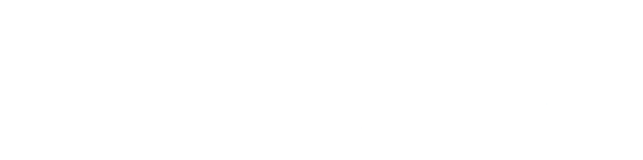
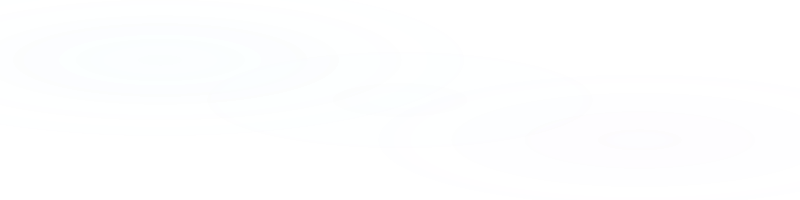
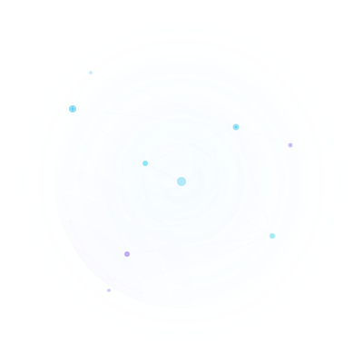

AI OS — Nikhil Rai

<!-- ===== BACKGROUND PARTICLES ===== -->

<!-- ===== OS CONTAINER ===== -->

  <!-- ============================== -->
  <!-- HERO SECTION                   -->
  <!-- ============================== -->
  

    

    

      

        

          
            
            AI OS v1.0
          
          · Control Center
        

        <h1 class="text-hero" style="margin: 0;">
          Nikhil Rai
        </h1>
        

          AI Engineer · Agentic Systems · Research Infrastructure
        

        

          Building autonomous AI systems that reason, retrieve, and accelerate scientific research. Focused on compound AI architectures and production-grade agentic frameworks.
        

        

          <a href="https://github.com/Nikhilrai27" class="hero-btn hero-btn-primary" target="_blank" rel="noopener">
            <svg width="16" height="16" viewBox="0 0 24 24" fill="none" stroke="currentColor" stroke-width="1.5" stroke-linecap="round" stroke-linejoin="round"><path d="M9 19c-5 1.5-5-2.5-7-3m14 6v-3.87a3.37 3.37 0 0 0-.94-2.61c3.14-.35 6.44-1.54 6.44-7A5.44 5.44 0 0 0 20 4.77 5.07 5.07 0 0 0 19.91 1S18.73.65 16 2.48a13.38 13.38 0 0 0-7 0C6.27.65 5.09 1 5.09 1A5.07 5.07 0 0 0 5 4.77a5.44 5.44 0 0 0-1.5 3.78c0 5.42 3.3 6.61 6.44 7A3.37 3.37 0 0 0 9 18.13V22"/></svg>
            GitHub
          </a>
          <a href="https://linkedin.com/in/nikhilrai27" class="hero-btn" target="_blank" rel="noopener">
            <svg width="16" height="16" viewBox="0 0 24 24" fill="none" stroke="currentColor" stroke-width="1.5" stroke-linecap="round" stroke-linejoin="round"><path d="M16 8a6 6 0 0 1 6 6v7h-4v-7a2 2 0 0 0-2-2 2 2 0 0 0-2 2v7h-4v-7a6 6 0 0 1 6-6z"/><rect x="2" y="9" width="4" height="12"/><circle cx="4" cy="4" r="2"/></svg>
            LinkedIn
          </a>
          <a href="#" class="hero-btn" target="_blank" rel="noopener">
            <svg width="16" height="16" viewBox="0 0 24 24" fill="none" stroke="currentColor" stroke-width="1.5" stroke-linecap="round" stroke-linejoin="round"><path d="M22 12h-4l-3 9L9 3l-3 9H2"/></svg>
            Portfolio
          </a>
          <a href="mailto:nikhilrai27@example.com" class="hero-btn">
            <svg width="16" height="16" viewBox="0 0 24 24" fill="none" stroke="currentColor" stroke-width="1.5" stroke-linecap="round" stroke-linejoin="round"><rect x="2" y="4" width="20" height="16" rx="2"/><path d="m22 7-8.97 5.7a1.94 1.94 0 0 1-2.06 0L2 7"/></svg>
            Email
          </a>
        

      

      

        
      

    

  

  <!-- ============================== -->
  <!-- BENTO GRID ROW 1               -->
  <!-- ============================== -->
  

    <!-- ABOUT -->
    

      

        

          
          About
        

        

          

            AI Engineer with deep expertise in building production-grade agentic systems, RAG pipelines, and research automation infrastructure.
          

          

            Currently architecting compound AI systems that combine retrieval, reasoning, and tool use for scientific discovery.
          

        

      

    

    <!-- AI CORE STATUS -->
    

      

        

          
          AI Core Status
        

        

          

            

              ResearchOS
              92%
            

            

              

            

          

          

            

              LangGraph
              85%
            

            

              

            

          

          

            

              FastAPI
              82%
            

            

              

            

          

          

            

              RAG Systems
              88%
            

            

              

            

          

          

            

              Docker
              70%
            

            

              

            

          

          

            

              MCP Protocol
              65%
            

            

              

            

          

        

      

    

    <!-- GITHUB STATS -->
    

      

        

          
          GitHub Analytics
        

        

          
          
        

      

    

  

  <!-- ============================== -->
  <!-- CONTRIBUTION GRAPH             -->
  <!-- ============================== -->
  

    

      

        

          
          Contribution Graph
        

        

          <picture>
            <source media="(prefers-color-scheme: dark)" srcset="https://raw.githubusercontent.com/Nikhilrai27/Nikhilrai27/output/github-contribution-grid-snake-dark.svg" />
            
          </picture>
        

      

    

  

  <!-- ============================== -->
  <!-- BENTO GRID ROW 2               -->
  <!-- ============================== -->
  

    <!-- STREAK -->
    

      

        

          
          Current Streak
        

        
      

    

    <!-- ACTIVITY GRAPH -->
    

      

        

          
          Activity
        

        
      

    

    <!-- TECH STACK -->
    

      

        

          
          Tech Stack
        

        

          

            
            Python
          

          

            
            FastAPI
          

          

            
            LangChain
          

          

            
            LangGraph
          

          

            
            Docker
          

          

            
            PostgreSQL
          

          

            
            Qdrant
          

          

            
            Git
          

          

            
            Linux
          

          

            
            OpenAI
          

          

            
            Gemini
          

          

            +
            More
          

        

      

    

  

  <!-- ============================== -->
  <!-- FEATURED PROJECTS              -->
  <!-- ============================== -->
  

    

      

        

          
          Featured Projects
        

        

          

            <h3>ResearchOS</h3>
            
AI-powered research operating system that coordinates multiple LLM agents for autonomous literature review, hypothesis generation, and experimental design.

            

              LangGraph
              FastAPI
              RAG
              Qdrant
            

            <a href="https://github.com/Nikhilrai27" class="project-link" target="_blank" rel="noopener">
              <svg width="14" height="14" viewBox="0 0 24 24" fill="none" stroke="currentColor" stroke-width="1.5" stroke-linecap="round" stroke-linejoin="round"><path d="M9 19c-5 1.5-5-2.5-7-3m14 6v-3.87a3.37 3.37 0 0 0-.94-2.61c3.14-.35 6.44-1.54 6.44-7A5.44 5.44 0 0 0 20 4.77 5.07 5.07 0 0 0 19.91 1S18.73.65 16 2.48a13.38 13.38 0 0 0-7 0C6.27.65 5.09 1 5.09 1A5.07 5.07 0 0 0 5 4.77a5.44 5.44 0 0 0-1.5 3.78c0 5.42 3.3 6.61 6.44 7A3.37 3.37 0 0 0 9 18.13V22"/></svg>
              Repository
            </a>
          

          

            <h3>Resume Analyzer</h3>
            
ATS-optimized resume analysis platform using multi-agent evaluation, semantic matching, and AI-powered recommendations for career growth.

            

              LLM
              FastAPI
              Docker
              PostgreSQL
            

            <a href="https://github.com/Nikhilrai27" class="project-link" target="_blank" rel="noopener">
              <svg width="14" height="14" viewBox="0 0 24 24" fill="none" stroke="currentColor" stroke-width="1.5" stroke-linecap="round" stroke-linejoin="round"><path d="M9 19c-5 1.5-5-2.5-7-3m14 6v-3.87a3.37 3.37 0 0 0-.94-2.61c3.14-.35 6.44-1.54 6.44-7A5.44 5.44 0 0 0 20 4.77 5.07 5.07 0 0 0 19.91 1S18.73.65 16 2.48a13.38 13.38 0 0 0-7 0C6.27.65 5.09 1 5.09 1A5.07 5.07 0 0 0 5 4.77a5.44 5.44 0 0 0-1.5 3.78c0 5.42 3.3 6.61 6.44 7A3.37 3.37 0 0 0 9 18.13V22"/></svg>
              Repository
            </a>
          

          

            

              
◆

              <h3>Future Project</h3>
              
Space reserved for next-generation AI research infrastructure.

            

          

        

      

    

  

  <!-- ============================== -->
  <!-- BENTO GRID ROW 3               -->
  <!-- ============================== -->
  

    <!-- LEARNING ROADMAP -->
    

      

        

          
          Learning Roadmap
        

        

          

            

              CrewAI Multi-Agent
              In Progress
            

            

              

            

          

          

            

              Rust Fundamentals
              Getting Started
            

            

              

            

          

          

            

              Kubernetes
              Planning
            

            

              

            

          

          

            

              RLHF & Alignment
              Exploring
            

            

              

            

          

        

      

    

    <!-- CONNECT -->
    

      

        

          
          Connect
        

        

          Open to collaborations on AI research infrastructure, agentic systems, and developer tooling.
        

        

          <a href="https://github.com/Nikhilrai27" class="connect-link" target="_blank" rel="noopener">
            <svg width="18" height="18" viewBox="0 0 24 24" fill="none" stroke="currentColor" stroke-width="1.5" stroke-linecap="round" stroke-linejoin="round"><path d="M9 19c-5 1.5-5-2.5-7-3m14 6v-3.87a3.37 3.37 0 0 0-.94-2.61c3.14-.35 6.44-1.54 6.44-7A5.44 5.44 0 0 0 20 4.77 5.07 5.07 0 0 0 19.91 1S18.73.65 16 2.48a13.38 13.38 0 0 0-7 0C6.27.65 5.09 1 5.09 1A5.07 5.07 0 0 0 5 4.77a5.44 5.44 0 0 0-1.5 3.78c0 5.42 3.3 6.61 6.44 7A3.37 3.37 0 0 0 9 18.13V22"/></svg>
            GitHub
          </a>
          <a href="https://linkedin.com/in/nikhilrai27" class="connect-link" target="_blank" rel="noopener">
            <svg width="18" height="18" viewBox="0 0 24 24" fill="none" stroke="currentColor" stroke-width="1.5" stroke-linecap="round" stroke-linejoin="round"><path d="M16 8a6 6 0 0 1 6 6v7h-4v-7a2 2 0 0 0-2-2 2 2 0 0 0-2 2v7h-4v-7a6 6 0 0 1 6-6z"/><rect x="2" y="9" width="4" height="12"/><circle cx="4" cy="4" r="2"/></svg>
            LinkedIn
          </a>
          <a href="https://x.com/nikhilrai27" class="connect-link" target="_blank" rel="noopener">
            <svg width="18" height="18" viewBox="0 0 24 24" fill="none" stroke="currentColor" stroke-width="1.5" stroke-linecap="round" stroke-linejoin="round"><path d="M4 4l11.733 16h4.267l-11.733 -16zM4 20l6.768 -6.768M19.5 4l-6.768 6.768"/></svg>
            X / Twitter
          </a>
          <a href="mailto:nikhilrai27@example.com" class="connect-link">
            <svg width="18" height="18" viewBox="0 0 24 24" fill="none" stroke="currentColor" stroke-width="1.5" stroke-linecap="round" stroke-linejoin="round"><rect x="2" y="4" width="20" height="16" rx="2"/><path d="m22 7-8.97 5.7a1.94 1.94 0 0 1-2.06 0L2 7"/></svg>
            Email
          </a>
        

      

    

    <!-- QUICK METRICS -->
    

      

        

          
          System Metrics
        

        

          

            
24

            
Repositories

          

          

            
847

            
Contributions

          

          

            
12

            
Stars Earned

          

          

            
3

            
Active Projects

          

        

      

    

  

  <!-- ============================== -->
  <!-- FOOTER                         -->
  <!-- ============================== -->
  

    

      
        
        System Online
      
      
      AI OS · Control Center v1.0
      
      Uptime: ∞
      
      Latency: 0ms
    

    

      
Nikhil Rai · AI OS

      
Designed with precision · Built with purpose

    

  

